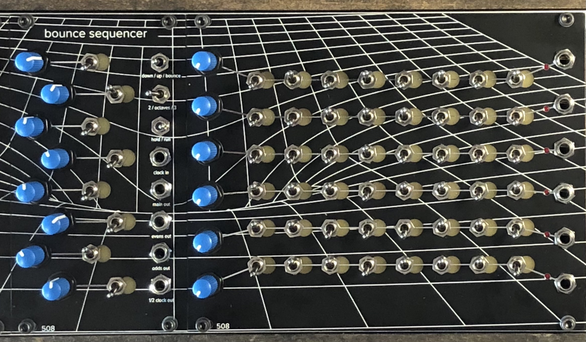

# Trigger Sequencer

An 8-step / 6 channel trigger sequencer with a pushbutton interface. Trigger width is controllable by the knobs, from a narrow trigger to a gate that can be . . . pretty wide. (a half-second? a second?)

The Trigger Sequencer WILL NOT DO ANYTHING without its sibling the Bounce Sequencer: https://github.com/508-loop-detected/bounce-sequencer

All of the actual logic is in the Bounce Sequencer, which connects via expansion bus on the back.

NEW: It also comes in a version with toggle switches!

NOTE TO BUILDERS: This project, like a lot of my projects, uses 2mm pin headers, NOT the more common 2.54mm pin headers. YOU WILL BE SAD if you don't make note of this difference!
